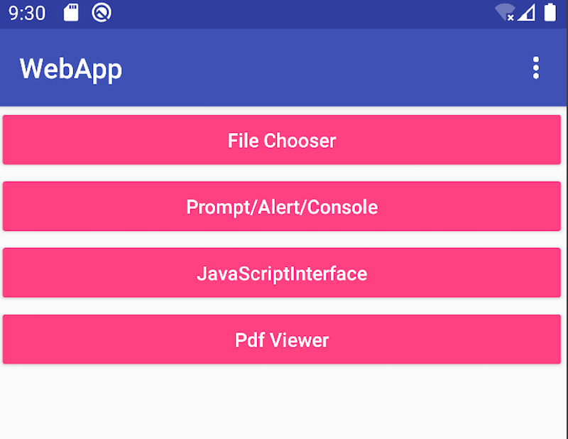
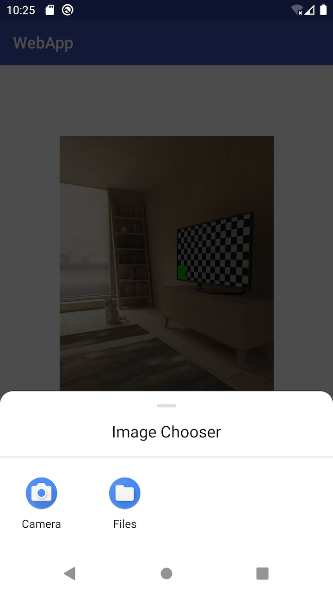
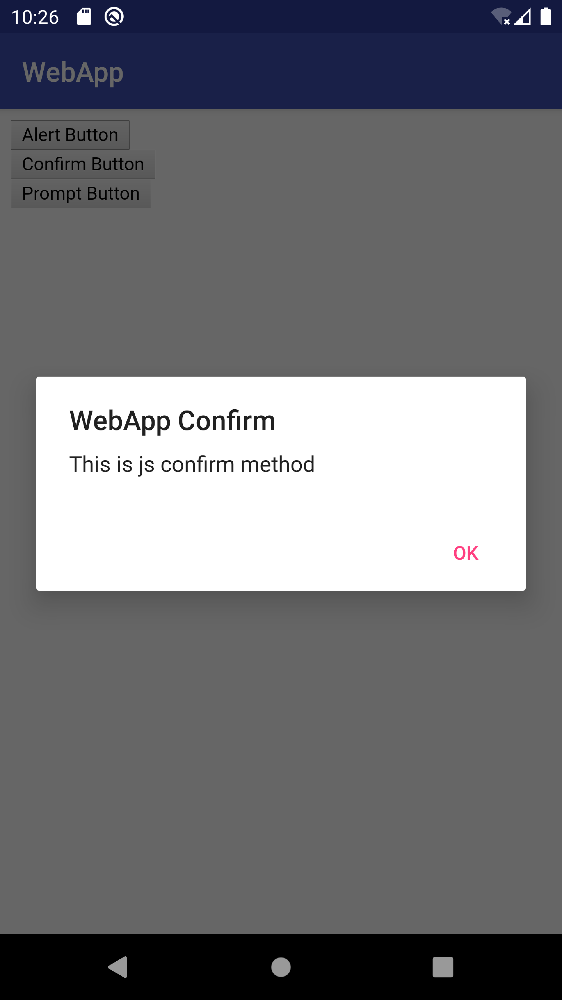
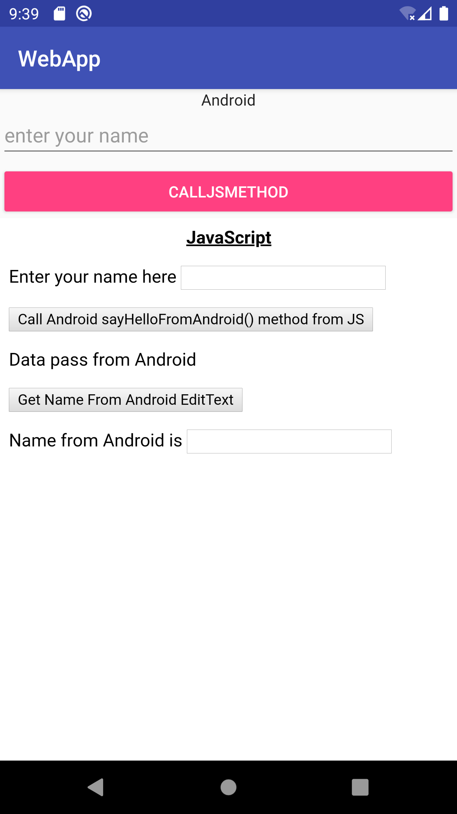
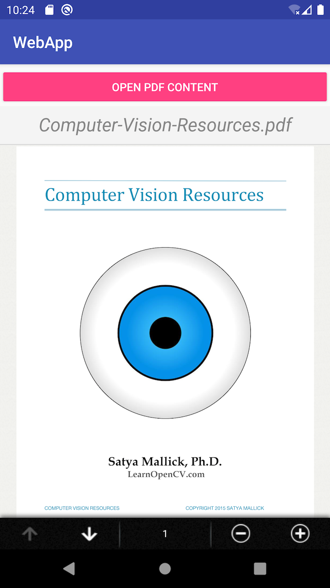

# webapp
This app demonstrates 4 common webapp scenarios:

+ FileChooser: open system gallery and pick a photo show in WebView
  
+ Prompt/Alert/Console: override `WebChromeClient` methods to hook js prompt, alert, console functions
  
+ JavaScriptInterface: use `@JavascriptInterface` to make js could call Java method
  
+ Pdf Viewer: use [pdf.js][pdfjs] to render pdf content in Android WebView
  
  
[pdfjs]:https://mozilla.github.io/pdf.js/
